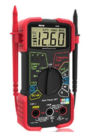

# LAB1 Getting Started

KiCad Spice .... [3 minute video](https://www.youtube.com/watch?v=AZ-9uZlOAGg) this is what you will be doing in future labs.

# Quick Starting point

The goal is to draw and simulate the most simple circuit possible. 

## Draw the Circuit

On the far right there is a symbol of an op amp ... which is in blue below. 

Click somewhere on the empty space and libraries will be formed. KiCad will sit there and think for a while. You need to choose parts from the pspice library.

Choose a resistor and VSOURCE. Connect them with the green line. 

## Connect Ground

This the step everyone forgets. You have to define where 0 volts are. This also [true in reality](https://www.restore-an-old-car.com/positive-ground-cars.html). The choice is arbitrary. A standard is what is most important. What you are doing here is setting a standard for calculation purposes. Every equation you write, every line of the simulation code needs to know where ground is.

## Stencil Work

V0 and R0, Vsource and 5 ohms are letters to be stenciled onto the circuit board. This is called art work. We are not going to focus on creating circuit boards in this class. That is a subject of specialization. But understand that KiCad is now the software of choice for designing circuit boards. 

## Spice values

The actual values such as 5 ohms and 5 volts need to be entered into the spice model. This is accessed through the Edit Spice Model button:

## Simulation

Simulation is another window that opens up. 

## Simulation Settings

The first step is to give simulation something to do. This is done in simulation settings. Here the DC source is varied between 0 and 10 volts.

After closing down the simulation settings, this black window appears where the simulation graph will eventually appear. It is called Plot1.

Now we can run the simulation by pressing the green arrow called Run/Stop Simulation. This is what happens:

There can be error messages in the white box. A good message is the number of data rows. In this case there are 101.

Now the goal is to add a graph. This is done by clicking on add signals above.

Here we can see how to display the current through R0 and the current through V0. Clicking on them one at a time creates this graph. 

## Simulation Analysis

## 

The sign conventions of KiCad can be seen to follow that of most electrical engineers. The voltage across the power supply is positive. The resistance is positive. The power is computed by I*V. The resistors power is positive because it is leaving the circuit. The voltage source is delivering power to the circuit, which by convention means that it is negative. Something is being removed from the voltage source and put into the circuit.  The absolute value of the current magnitudes are the same because current follows in the same direction through a circuit. 

It is the relationship between the polarity of the current and voltage (leaving the + terminal of the supply, entering the + terminal of the resistor) that generates the negative sign. 

# Next Task, Build a more complicated Circuit. 

Add a resistor in series .. build a voltage divider and repeat the above.

# Next Task, Measure resistance and Capacitance

You are going to be assigned equipment that is yours to organize, and keep working. There are lots of tiny parts in them. Managing this equipment is part of this course. Here are some do's and don'ts

These and a few other things are in a try assigned to you that can be taken home. But you need to get permission to do this. The expectation is that they will stay in the lab.

## Do's and Don'ts

Don’t run down to the engineering rooms or technology rooms and go through part trays.

Organize your own part tray. Claiming a part is missing will be respected only after seeing a well organized part tray. 

Don’t swap if you think something is broken. See your instructor.

Be gentle with usb cable insertion into the analog discovery. 

All problems occur when wiggling the usb mini end into the analog discovery.

Learn to measure actual part values in the first lab. Nominal, ideal values are only used during simulation. 

Measure the values. Don’t try to stare at the colors/markings to figure out what their nominal values are. Sort them, organize them on the breadboard so that you can use the same resistors and capacitors over and over again. Get to know them.

## Shared Lab Equipment

This lab is kept in cabinents behind locked doors. They are numbered and there is a tray assigned to them. They are shared by multiple classes ... 3 this semester. They are not yours. You leave a mess, someone else will have to wade through it or clean it up. Don't raid another tray's cables. Talk to your instructor if you think something is missing.

 The device that could do the most physical damage to you is the DC power supply below. Don't set anything to see sparks. 

## Measure Resistance 2 Ways

These two instruments measure resistance. Grab several resistors from your kit and measure resistance on both of them. Record the values you measure and the color bands here. Collect enough data so that you can answer these questions. 

Write your answers here in this document and upload to Github. Make a table of data here if you can.

Do the meters agree? 

| resistor | handheld DMM | desktop MM | colors          |
| -------- | ------------ | ---------- | --------------- |
| r1       | 0.995 M      | 0.99283 M  | Br_B_Gr_Gld     |
| r2       | 1.023 M      | 1.02019 M  | Br_B_Gr_Gld     |
| r3       | 99.1         | 98.776     | Br_B_Br_Gld     |
| r4       | 98.8 k       | 98.457 k   | Br_B_Y_Gld      |
| r5       | 1.483 k      | 1.4819 k   | Br_Gr_R_Gld     |
| r6       | 0.458 k      | 0.45765 k  | too dark to see |
| r7       | 9.82 k       | 9.7988 k   | Br_B_O_Gld      |

Which meter do you trust the most?  Why?

i trust the hand held more, but this is due to experience w/ handheld models....the desktop model is probably MORE accurate, but i have less experience w/ this style

Which is most expensive?

the desktop model....project that the handheld model costs  > $30....project the desktop model costs < $500

Which needs to be powered off?

ideally BOTH, but the handheld has an "Auto Power Off" label

How does touching the metal of the probes damage the probes?

it will add oil from your skin onto the probes & increase the resistance being read

What is the resistance of the probe wires themselves?

handheld BLK; 0.128 ohms

handheld RED; 0.141 ohms

desktop RED; 0.1 ohms

desktop BLK; 0.2 ohms

When does the resistance of the probe wires matter?

does it? 

What do the meters display when measuring the resistance of an open?

handheld : O.L....open lead

desktop; OVL.D 

What do the meters display when measuring the resistance of a short?

desktop; 0.064 ohms

handheld; 0.0 ohms

This is the [original kit purchased containing your resistors](https://store.digilentinc.com/analog-parts-kit-by-analog-devices-companion-parts-kit-for-the-analog-discovery/). What resistor values were shipped? 

does not list dedicated resistors; closest it has are 3 potentiometers 5K, 10K and 50K

Can you find them all?

cannot confirm  ^^^^^^ see above ^^^^^

What is the E12 series of [resistors](http://www.resistorguide.com/resistor-values/) ? 

resistors w/ a 10% tolerance

In what way could two identical looking resistors differ, and have the same resistance?

having different color bands (resistances)  but the tolerance (variance) of resistances could cause them to overlap/ have the same values

Develop away of organizing your resistors, so you can put it in a circuit, and know what it's value is the rest of this class. 

get little zip lock bags & compile

## Capacitance and Inductance

You may notice that resistance value fluctuates. This indicates that capacitance or inductance is present.

What resistor values are most likely to fluctuate?

desktop shows fluctuation on both high (kilo / mega) and lo (ohms)

Does spreading the cables out as far apart change this fluctuation?

no change in fluctuation seen

Does coiling or uncoiling the cables cause changes?

no change in fluctuation seen

## BreadBoards

Stick one of a resistor into a breadboard. 

Stick a second resistor somewhere else in the breadboard.

Map out which holes in the breadboard are shorted together.  Use the art work on the bread board to document what is connected to what.

numbers >>> a-e & f-j

i.e. port 15a is shorted to 15b,15c,15d,15e

# If you have Time

Work in the simulator. 

Start with this [video](https://www.youtube.com/watch?v=nkixhhx8i3Q)

Can get most libraries from [robustdesignconcepts.com](http://robustdesignconcepts.com/files/pspice/libs/) including the **anl_misc.lib** which is included in the lab folder of this repo. This means that you can skip the orcad process in the video.

There are [TI spice models in these zip files](http://www.ti.com/design-resources/design-tools-simulation/models-simulators/spice-library.html). There are zips inside of zips that are hard to find. The starting point is the component name. 

