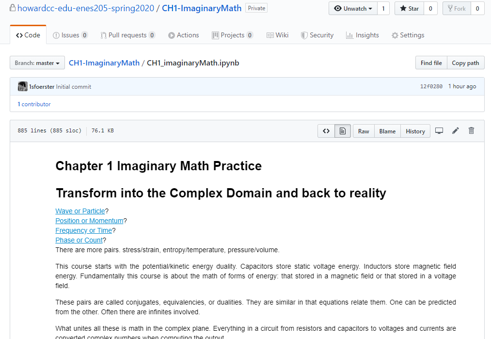
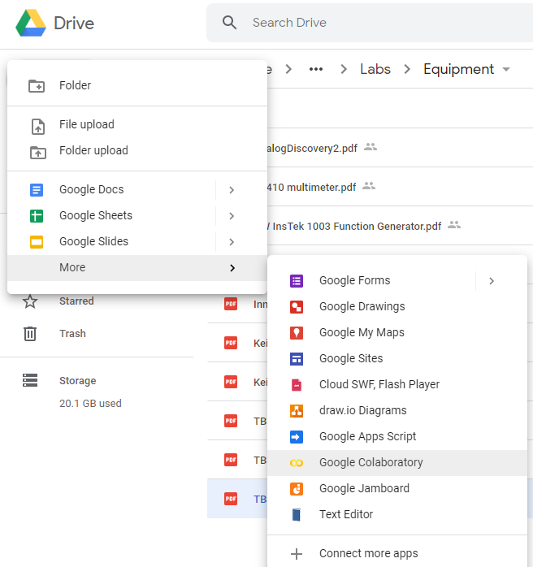
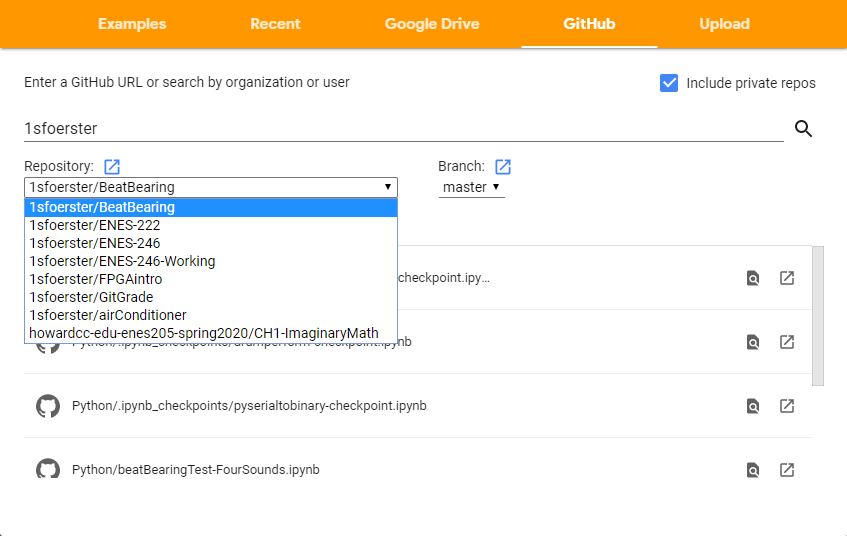
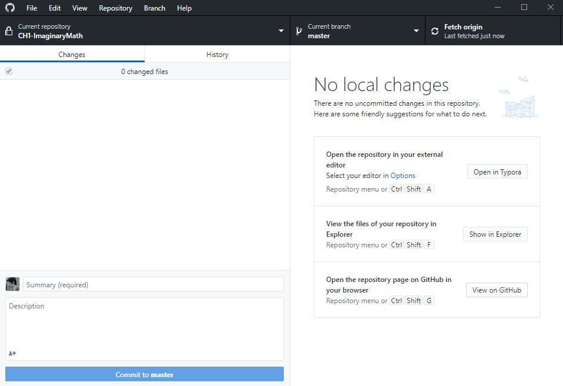
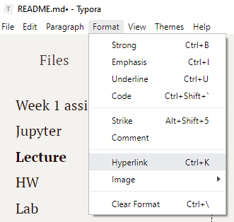

# Week 1 assignments

Lectures and HW are going to be *.ipynb (jupyter notebook) files. Labs are going to be a variety of files in their own separate folder. The link below is to the starting point description of what to do in the lab. 

# Displaying Jupyter

Jupyter notebook files can be accessed three ways:

1. **Anaconda** After accepting an assignment and downloading into your local computer with github desktop, Anaconda can be used to look at the ipynb file. This will give you the best rendering of the ipynb file. This is what the instructor will be working with in class. 

2. **Github** This gives you the worst rendering of the ipynb file. [LaTeX](https://www.latex-project.org/) is rendered slowly and with problems. Interactive graphics may not be displayed and may not work. 

   

3. Google Colab is installed by clicking on new underneath google drive, then more then on google colaboratory. 

You will need to replace the lecture 1 to your google drive assignment. The links below are going to work for the instructor that creates the assignment, but they are not going to work for you. You don't have access to the instructors assignment "repo", just like you don't have access to other students "repos" in this class. 

However, your instructor is going to have access to your repo. To improve your instructors ability to grade and your own productivity, you need to figure out how to link to google colab. [This](https://towardsdatascience.com/google-drive-google-colab-github-dont-just-read-do-it-5554d5824228) contains step by step instructions, but there is an easier way. 

Click on this URL http://colab.research.google.com/github

Click on view on github:

Then just copy from github into google colab until you see the ipynb rendered in colab. Copy the link in colab.  In Typora, highlight the words below to link and click on Format Hyperlink or Ctrl-K. 

# Lecture

Lectures closely follow the book. Examples are done in sympy/numpy rather than trusting you to know how to use a calculator.  

Calculators will become useless in this class unless you begin to program them. This is discouraged. Such calculators have become a cheating tool and are discouraged on the PE and FE exams. Describing your calculator on a resume or in a job interview makes you look old. 

[Lecture 1](https://colab.research.google.com/github/howardcc-edu-enes205-spring2020/CH1-ImaginaryMath/blob/master/CH1_imaginaryMath.ipynb) ... emphasizes sympy as replacement of a calculator, starts with imaginary math

# HW

[HW 1] ... units, graphing, solves problems at the end of chapter 1 using numpy which is an open source version of matlab, mathplot lib, which shows you how to plot functions

# Lab

[Lab 1 .. local computer typora link](./Lab1) 
[Lab 1 .. github link](https://github.com/howardcc-edu-enes205-spring2020/CH1-ImaginaryMath/blob/master/Lab1.md)

So far there is not a way to display *.md files or markdown files in CoLab. 

Getting started .. reviews all the equipment manuals, talks about measuring, error collection, sorting components in kits that are checked out, measuring component values. 